يتم إنشاء الكثير من الأدوات الرائعة للمساعدة في تعزيز تطور **JAMstack**. و يتبنى المطورون هاته الأدوات و يعملون على تطويرها و تحسينها. أحد هاته الأدوات تسمى **مولدات المواقع الساكنة** (Static Sites Generators). و يُعد [**Gridsome**](https://gridsome.org/){id="ext-link"} مثال على أحد مولدات المواقع الساكنة و الذي سنتطرق إليه في هاته المقالة.<br /><br />

في الفقرة أعلاه هنالك كلمة مكتوبة بالخط العريض (**JAMstack**). إذا لم تكن لديك أدنى فكرة بخصوص هذا المصطلح, فأقترح عليك قراءة هاته المقالة [**ما هو JAMstack ؟**](https://www.tutomena.com/web-development/javascript/what-is-jamstack/){id="ext-link"} <br /><br /><br />

# ما هو مولد المواقع الساكنة {id="toc0" class="font-bold text-2xl mb-6"}

المواقع الساكنة فعليا تعاملنا معها سابقا عندما بدأنا في تعلم مجال الويب حين كنا نلعب مع الـ HTML , CSS و بعض الجافاسكربت و كنا حينها نسمي الموقع ساكن (Static), فلم يكن هنالك تفاعل ما بين الموقع و المستخدم له . قد يتبادر إلى ذهنك لما علي إنشاء موقع ساكن بإستخدام Gridsome اذا كنت أستطيع عمل ذلك بالـ HTML, CSS و الجافاسكربت ؟! <br />
مولدات المواقع الساكنة تقوم بإنشاء مواقع ساكنة أيضا لكن بفلسفة و مفهوم آخر يُضفي ميزات اثناء مرحلة التطوير, كما يجعل من هذا الموقع الساكن سريع جدا, عالي الحماية, قوي و مرن.<br /><br /><br />

# ما هو Gridsome {id="toc1" class="font-bold text-2xl mb-6"}

الـ **Gridsome** عبارة عن مولد مواقع ساكنة (**SSG**) مدعوم و يعتمد على إطار العمل [**Vue.js**](https://vuejs.org/){id="ext-link"} يعمل على إنشاء مواقع ساكنة سريعة جدا. يعتمد على طبقة GraphQL للحصول على البيانات من مصادر مختلفة من أجل إنشاء منها صفحات ديناميكية.
[](){style="margin: 20px 0; display: block;"}

<span class="note">**ملاحظة :** SSG هي إختصار لـ Static Sites Generator</span><br /><br /><br />

# مميزات Gridsome {id="toc2" class="font-bold text-2xl mb-6"}

- يعتمد على إطار العمل Vuejs في ناحية الفرونت آند (frontend) :<br />
  &nbsp; فسنستفيد من مميزات الـ vuejs في بناء واجهات إحترافية.
- ميزة Hot Reloading Dev :<br />
  &nbsp; عندما نقوم بالتغيير في الكود نلاحظ هاته التغييرات في المتصفح مباشرة بدون الحاجة لتحديث الصفحة.
- ميزة auto optimized code :<br />
  &nbsp; يقوم بتحزيم و تصغير حجم الكود تلقائيا .
- تحسين الصور :<br />
  &nbsp; جميع الصور يتم تحسينها و ضغطها بشكل آلي يضمن سرعة تحميلها و عرضها في الموقع.
- لا وجود لإعادة تحميل الصفحات :<br />
  &nbsp; ففي النهاية سيكون لدينا تطبيق أحادي الصفحة (SPA).
- جلب و إعداد الموارد مسبقا (pre-fetching) :<br />
  &nbsp; يقوم الـ Gridsome بقراءة كل الروابط الموجودة في الصفحة و تحميلها في الكاش إستعدادا لطلبها من قبل المستخدم . فتكون لدينا سرعة كبيرة في إرجاع الطلب و عرض الصفحات.
- ميزة GraphQL Data Layer :<br />
  &nbsp; يعتمد على الـ GraphQL في الحصول على الـ data من الـ APIs و جلب فقط ما نريد من بيانات .
- ميزة data sourcing :<br />
  &nbsp; البيانات يُمكن جلبها من APIs , ملفات ماركداون (markdown), من أنظمة إدارة المحتوى كالووردبريس على سبيل المثال . فإذا كانت لديك بيانات موجودة على نظام ووردبريس فبكل سهولة يُمكنك نقلها إلى هذا الموقع المولد من طرف Gridsome . و كمثال حقيقي على عملية النقل هاته يمكنك قراءة هاته المقالة على مدونة توتومينا [لهذه الأسباب نقلت مدونة توتومينا من ووردبريس إلى Gatsby.js](https://www.tutomena.com/blogging/switching-from-wordpress-to-gatsbyjs/){id="ext-link"} هو يستخدم رياكت و بالتالي اختار مولد مواقع ساكنة يعتمد على رياكت إسمه **Gatsby.js**
- درجة عالية للحماية و الأمان :<br />
  &nbsp; فهو لا يتوفر على قواعد بيانات, ففي النهاية سيكون لدينا موقع ساكن بسيط (html,css,javascript) .
- السرعة :<br />
  &nbsp; كما هو معروف المواقع الساكنة تكون أسرع بكثير من المواقع الديناميكية . لأنه لن يكون لدينا http requests (طلبات http) و إنتظار إجابات (responses) و أيضا مواضيع أخرى مثل الـ validation … و هاته كلها تٌبطىء من سرعة الإستجابة .<br /><br /><br />

# كيف يعمل Gridsome {id="toc3" class="font-bold text-2xl mb-6"}

**Gridsome** هو إطار عمل لتطوير مواقع الويب يُمكننا من إنشاء مواقع ثابتة سريعة و آمنة. يقوم بجلب البيانات من مصادر بيانات كـأنظمة إدارة المحتوى (CMS), ملفات محلية (local files), APIs,... و تخزينها في قاعدة بيانات محلية. تُتيح لنا طبقة بيانات GraphQL الموحدة (<span class="explanation">تعمل GraphQL كنظام مركزي يحتوي على كل البيانات و يتم إدارة هاته البيانات من قبلها</span>) من إستخراج البيانات التي نحتاجها فقط من قاعدة البيانات و استخدامها في مكونات vue.js المسؤولة عن عرضها. يتم إنشاء البيانات و تخزينها على شكل **static JSON** وقت الإنشاء (Build Time).

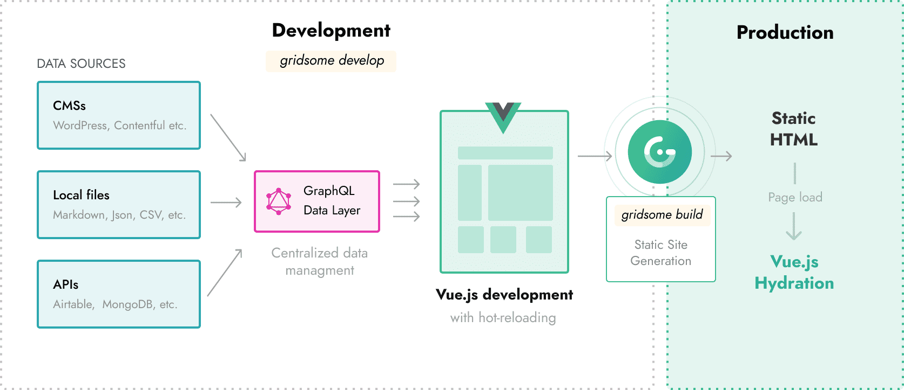

هنالك طريقتان لتشغيل **Gridsome** :

- `gridsome develop`
  تشغيل خادم تطوير محلي (local development server).
- `gridsome build`
  توليد ملفات ثابتة جاهزة للإنتاج (Deploy).

<hr />

### # الأمر Gridsome develop {class="my-8 font-bold"}

يقوم هذا الأمر بتشغيل خادم التطوير المحلي مع خاصية **hot-reloading** التي تعمل على إعادة تحميل للصفحة تلقائيا عند اي تغييرات في الكود أو الملفات. و طبقة بيانات GraphQL.<br />
عادة خادم التطوير المحلي يشتغل على **localhost:8080**, و طبقة بيانات GraphQL على **localhost:8080/\_\_\_explore**.


إليك ما يحدث وراء الكواليس عند تشغيل الأمر `gridsome develop`:<br /><br />

- تهيئة -- قراءة إعدادات المشروع و تجهيز الإضافات المثبتة (installed plugins), إلخ.
- تحميل المصادر -- جلب الإضافات (source plugins) للبيانات و تحديث قاعدة البيانات المحلية.
- إنشاء مخطط GraphQL -- يُنشئ مخطط GraphQL من أنواع العقد الموجودة في قاعدة البيانات المحلية.
- توليد الكود -- يُنشىء الكود الذي يشتغل أثناء وقت التشغيل (Runtime code) مثل المسارات (Routes),الإضافات (Plugins), و ما ذلك...
- Bootstrap finish -- يبدأ خادم التطوير في العمل و يُظهر عنواين Url (لتصفح كل من التطبيق أو طبقة بيانات GraphQL) في شاشة سطر الأوامر (Console).
  <hr />

### # الأمر Gridsome build {class="my-8 font-bold"}

يقوم هذا الأمر بإعداد المشروع لوضع الإنتاج (Production). هذا يعني أنه يُنشىء ملفات HTML مُحسنة و جاهزة للإستظافة و نشرها على أي **FTP** أو **Static Web Host**.


إليك ما يحدث وراء الكواليس عند تشغيل الأمر `gridsome build`:<br /><br />

- تهيئة -- قراءة إعدادات المشروع و تجهيز الإضافات المثبتة (installed plugins), إلخ.
- تحميل المصادر -- جلب الإضافات (source plugins) للبيانات و تحديث قاعدة البيانات المحلية.
- إنشاء مخطط GraphQL -- يُنشئ مخطط GraphQL من أنواع العقد الموجودة في قاعدة البيانات المحلية.
- توليد الكود -- يُنشىء الكود الذي يشتغل أثناء وقت التشغيل (Runtime code) مثل المسارات (Routes),الإضافات (Plugins), و ما ذلك...
- Bootstrap finish -- يُنشئ قائمة انتظار مع كل الصفحات والقوالب.
- تشغيل GraphQL -- يُنفذ جميع إستعلامات `page-query` و تخزين النتائج في ملفات `json`.
- تجميع الـ assets (صور,ملفات التنسيق,ملفات جافاسكربت,...) -- تشغيل **webpack** لتجميع assets جاهزة للإنتاج (النشر).
- معالجة HTML -- معالجة جميع الصفحات و القوالب في ملفات HTML ثابتة.
- معالجة الملفات -- يتم نسخ الملفات المحلية إلى مجلد **dist**.
- معالجة الصور -- تتم معالجة الصور المحلية و نسخها إلى مجلد **dist**.

<hr /><br /><br />

# المتطلبات {id="toc4" class="font-bold text-2xl mb-6"}

لإتباع هاته المقالة التعليمية تحتاج إلى التالي:

- يجب أن تكون لديك معرفة في Vuejs, Javascript, CSS, HTML و كيفية إستخدام سطر الأوامر (Terminal).
- تُعتبر معرفة آلية عمل GraphQL شيىء جيد و إضافي, و لكنها ليست مطلوبة فمن خلال الـ Gridsome ستتعلم البعض عنها.
- يتطلب تشغيل Gridsome إصدار نود جي اس (node.js) 8.3 فما فوق و يوصى بإستخدام مدير الحزم `Yarn` بدلا من `Npm`.<br /><br /><br />

# تثبيت Gridsome {id="toc5" class="font-bold text-2xl mb-6"}

أول شيء سنفعله هو التحقق من تثبيت Node و npm/yarn.

```bash
node --version && npm --version
```

بعدها يُمكنك تثبيت أداة **Gridsome CLI** عن طريق تشغيل الأمر التالي:

```bash
yarn global add @gridsome/cli
```

أو <br />

```bash
npm install --global @gridsome/cli
```

الخطوة التالية هي إنشاء مشروع جديد باستخدام CLI الذي قمنا بتثبيته للتو:

```bash
gridsome create gridsome-demo
```

بمجرد الانتهاء من التثبيت ، يمكننا تشغيل موقع Gridsome بهذا الأمر:

```bash
cd gridsome-demo/ && gridsome develop
```

يُمكنك معاينة أول موقع لك بإستخدام Gridsome على الرابط: `http://localhost:8080` <br /><br /><br />

# بنية المشروع {id="toc6" class="font-bold text-2xl mb-6"}

```
.
├── package.json
├── gridsome.config.js
├── gridsome.server.js
├── static/
└── src/
    ├── main.js
    ├── index.html
    ├── App.vue
    ├── layouts/
    │   └── Default.vue
    ├── pages/
    │   ├── Index.vue
    │   └── Blog.vue
    └── templates/
        └── BlogPost.vue
```

<hr />

### # المجلد الجذر (الرئيسي) {class="my-8 font-bold"}

#### ملف package.json {class="mt-4 font-bold"}

يحتوي على معلومات بخصوص الإضافات و التبعيات التي يحتاجها المشروع.

#### ملف gridsome.config.js {class="mt-4 font-bold"}

يحتوي على إعدادات و خيارات للإضافات التي يتم تثبيتها.

#### ملف gridsome.server.js {class="mt-4 font-bold"}

هذا الملف إختياري و يُستخدم للوصول ﻷجزاء مختلفة من خادم Gridsome.

<hr />

### # المجلد /src {class="my-8 font-bold"}

#### ملف Main.js {class="mt-4 font-bold"}

إستدعاء ملفات التنسيق و الإضافات يكون في هذا الملف. في هذا المكان يتم إضافة إضافات Vue, تسجيل المكونات, التوجيهات (Directives),...

#### مجلد Layouts {class="mt-4 font-bold"}

هنا يتم إنشاء مكونات التخطيط العامة (Layouts Components) مثل الهيدر, القائمة الجانبية, الفوتر,...

#### مجلد Pages {class="mt-4 font-bold"}

جميع المكونات في هذا المجلد تُصبح صفحات الموقع. كل صفحة تحصل على مسارها حسب مكان ملف المكون.
هذا المكون `src/pages/Index.vue` سيكون الصفحة الرئيسية للموقع, بينما `src/pages/AboutUs.vue` ستكون الصفحة على المسار `example.com/about-us`.

#### مجلد Templates {class="mt-4 font-bold"}

عند إستيراد او جلب بيانات من مصدر بيانات خارجي, مثلا مقالات من مدونة wordpress, إلى الموقع فإن كل مقالة سيكون لها شكل معين تظهر فيه. هذا الشكل نسميه بالقالب و هو عبارة من ملف **.vue** و على إسم القالب ان يتطابق مع نوع العقدة في مخطط GraphQL. فإذا كان نوع العقدة **Post** سيكون إسم ملف القالب **Post.vue**.

#### ملف index.html مخصص {class="mt-4 font-bold"}

في بعض الأحيان نحتاج إلى التعديل على قالب HTML الأساسي الذي يوفره Gridsome الذي من خلاله يتم انشاء الصفحات. Gridsome جعل اﻷمر سهل جدا. كل ما عليك فعله هو انشاء ملف **index.html** جديد في مجلد **/src**.

#### ملف App.vue مخصص {class="mt-4 font-bold"}

يُعد ملف **App.vue** المكون الرئيسي الذي يحوي كل الصفحات و القوالب. يمكنك تخصيص الملف الإفتراضي من خلال إنشاء ملف **App.vue** في مجلد **/src**.

<hr />

### # المجلد /static {class="my-8 font-bold text-xl"}

يتم نسخ الملفات الموجودة في هذا المجلد مباشرة إلى مجلد الإنتاج النهائي **/dist** أثناء عملية الـ **build**. على سبيل المثال ملف `static/robots.txt` سيكون موجود على **https://yoursite.com/robots.txt**.

<hr /><br /><br />

# الإضافات {id="toc7" class="font-bold text-2xl mb-6"}

في الغالب عند التعامل مع gridsome ستحتاج إلى إستخدام إضافات تؤدي غرض معين, هاته الإضافات تأتي ببعض الخيارات التي يُمكن التعديل عليها بما يُناسب. في هاته المقالة سنعمل على إنشاء مدونة بسيطة و سنعتمد على تخزين المقالات في ملفات **markdown**, و بالتالي سنحتاج إلى تسطيب الإضافة التي تسمح لك بذلك. (<mark class="font-bold">مدونة سينتاكس تم برمجتها بإستخدام Gridsome و تستخدم ملفات markdown في تخزين المقالات. فقط حتى تعرف ما قد يمكنك فعله, بغض النظر عن المدونة البسيطة التي سنقوم بإنشائها في هذا المقال.</mark>)<br /><br />

الإضافات الخاصة بالـ Gridsome تجدها على الرابط التالي : [**Plugins**](https://gridsome.org/plugins/){id="ext-link"}

نحتاج إلى تثبيت بعض الإضافات المساعدة :<br /><br />

```bash
yarn add @gridsome/transformer-remark
yarn add @gridsome/source-filesystem
```

أو <br />

```bash
npm install @gridsome/transformer-remark
npm install @gridsome/source-filesystem
```

<br />

تعمل إضافة `gridsome/transformer-remark@` على تحويل ملفات markdown إلى كود HTML يُمكن عرضه في الموقع.<br /><br />

تعمل إضافة `gridsome/source-filesystem@` على تحويل الملفات إلى محتوى يُمكن جلبه من خلال **GraphQL** إلى المكونات (**components**).<br /><br />

و بعدها نحتاج إلى التعديل على ملف **gridsome.config.js** :<br /><br />

```js{codeTitle: "In gridsome.config.js"}
module.exports = {
  siteName: "simple blog",
  plugins: [
    {
      use: "@gridsome/source-filesystem",
      options: {
        path: "content/posts/**/*.md",
        typeName: "Post",
      },
    },
  ],
  templates: {
    Post: "/posts/:title",
  },
};
```

<br />

هنا نُخبر Gridsome أن يقوم بإستخدام `gridsome/source-filesystem@` مع تعديل بعض الخيارات (Options) :

- **path** مسار تواجد الملفات أين ستنظر فيه هاته الإضافة و يجب ان يكون من نمط glob بهذا الشكل `(md.*/**/)`
- **typeName** نوع GraphQl و اسم القالب. ملف `.vue` في المسار `src/templates` يجب ان يُطابق هذا الإسم.
- في الخيار **templates** نقوم بتعريف القالب الذي سيحوي المقالات التي يتم تحويلها إلى محتوى قابل للعرض في الموقع عن طريق vue.js component مع الرابط الديناميكي الذي سيعرض لنا جميع المقالات إعتمادا على `title:`.

<br />

أما بالنسبة لـ `gridsome/transformer-remark@` بمجرد تثبيته في المشروع يتم إستخدامه بشكل تلقائي.<br /><br /><br />

# تثبيت Tailwindcss للتنسيق {id="toc8" class="font-bold text-2xl mb-6"}

في هذا التطبيق سوف أعتمد على إطار العمل [**Tailwindcss**](https://www.tailwindcss.com/){id="ext-link"} من أجل تنسيق المكونات. هنالك إضافة تُمكننا من تضمين **tailwindcss** في الموقع بكل بساطة, لكن نحن سنقوم بتضمينه بدون أي إضافة.

<br />

أولا نحتاج إلى تثبيت حزمة **tailwindcss** في المشروع من خلال الأمر :

```bash
yarn add tailwindcss
or //
npm i tailwindcss
```

<br />

ثانيا نحتاج إلى إنشاء ملف إعداد **tailwindcss** (خطوة إختيارية - تحتاج لهذا الملف إذا ما أردت التعديل في هذا الإطار) من خلال الأمر :

```bash
npx tailwind init
```

<br />

الأمر السابق سيقوم بإنشاء لنا ملف **tailwind.config.js** في المجلد الجذر (root directory).

<br />

ثالثا سوف نحتاج إلى تضمين Tailwindcss في Gridsome (المشروع) عن طريق إنشاء ملف و لنُسمه **tailwind.css** في المسار `assets/css` و إضافة إليه التالي :

<br />

```css{codeTitle: "In assets/css/tailwind.css"}
@tailwind base;
@tailwind components;
@tailwind utilities;
```

<br />

و بعدها نقوم بإضافته في ملف `main.js`

<br />

```js{codeTitle: "In src/main.js"}
// Import tailwindcss
import "~/assets/css/tailwind.css";

import DefaultLayout from "~/layouts/Default.vue";

export default function(Vue, { router, head, isClient }) {
  // Set default layout as a global component
  Vue.component("Layout", DefaultLayout);
}
```

<br />

و آخـرا نُضيف الـ **tailwindcss** إلى ملف إعدادات **gridsome**:

<br />

```js{codeTitle: "In gridsome.config.js"}
const tailwindcss = require("tailwindcss");

module.exports = {
  siteName: "simple blog",
  plugins: [
    // ...
  ],
  css: {
    loaderOptions: {
      postcss: {
        plugins: [tailwindcss],
      },
    },
  },
};
```

<br /><br />

# عرض مكون Layout {id="toc10" class="font-bold text-2xl mb-6"}

نقوم بتشغيل الموقع عن طريق تنفيذ الأمر التالي `gridsome develop` و زيارة الرابط `http://localhost:8080/`, ستكون لدينا صفحة عرض بالشكل التالي:

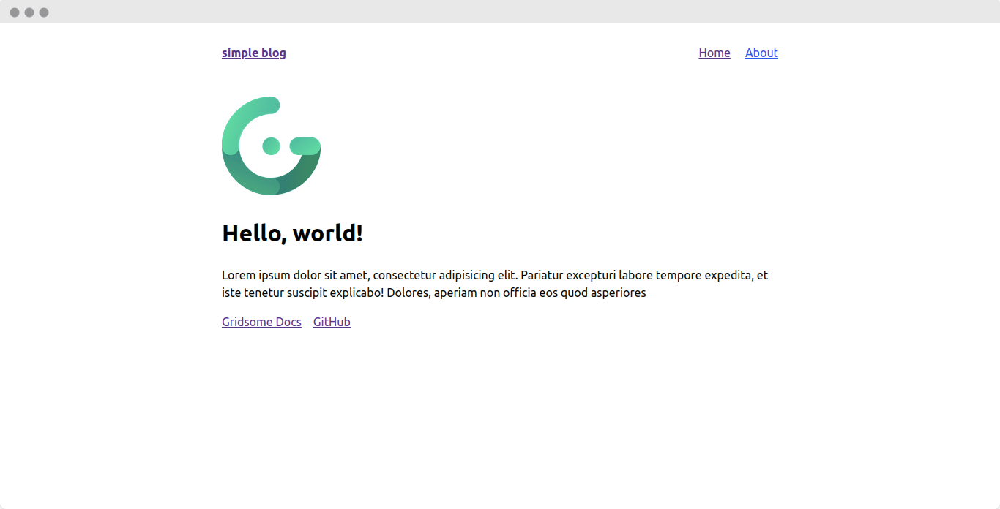

لدينا الملف `src/pages/Index.vue` المسؤول عن عرض الصفحة الرئيسية للموقع.

نقوم بالتعديل عليه بالشكل الآتي:

<br />

```html{codeTitle: "In src/pages/Index.vue"}
<template>
  <Layout> </Layout>
</template>

<script>
  export default {
    metaInfo: {
      title: "index page",
    },
  };
</script>
```

<br />

في جزئية الـ `metaInfo` قُمنا بتغيير عنوان الصفحة الحالية التي نحن فيها. طبعا يُمكن تعديل الكثير لكن نكتفي بهذا القدر حاليا. ليكون لدينا الناتج التالي:

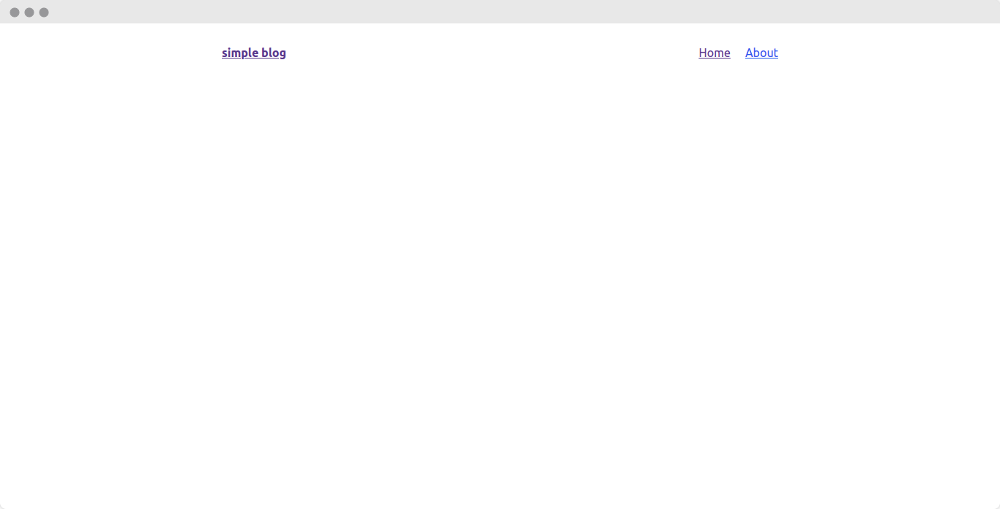

قد يتبادر إلى ذهنك أين يتواجد هذا النافبار (navbar)!!

هاته هي قوة الـ **Layouts** إذ تسمح لنا بمشاركة مكونات عادة ما تكون متكررة في كل الصفحات مثل الهيدر, الفوتر, ...

نأتي على المسار `src/layouts/Default.vue` و نُضيف الكود التالي:

<br />

```html{codeTitle: "In src/layouts/Default.vue"}
<template>
  <div class="layout">
    <h1 class="text-5xl mt-4">Gridsome Blog</h1>
    <p class="mb-24 font-bold">
      A simple blog designed with Gridsome
    </p>
    <slot />
    <footer class="mt-24 font-bold">
      built with <strong>Gridsome</strong>
    </footer>
  </div>
</template>

<style>
  body {
    font-family: -apple-system, system-ui, BlinkMacSystemFont, "Segoe UI",
      Roboto, "Helvetica Neue", Arial, sans-serif;
    margin: 0;
    padding: 0;
    line-height: 1.5;
  }

  .layout {
    max-width: 760px;
    margin: 0 auto;
    padding-left: 20px;
    padding-right: 20px;
    text-align: center;
  }

  footer strong {
    color: #4caf50;
  }
</style>
```

<br/>

فيُصبح لدينا الشكل التالي:

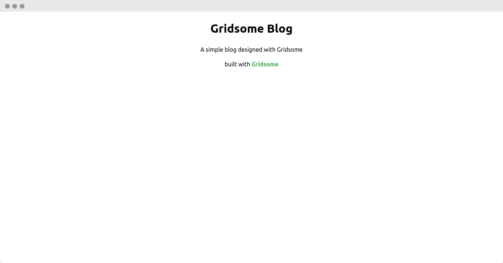

نكتفي بهذا القدر بالنسبة لشكل الصفحة الرئيسية. الآن ما بين الهيدر و الفوتر نُريد عرض قائمة تحتوي المقالات. لهذا سنقوم بإنشاء مُكون جديد على المسار `src/components` بإسم `PostList.vue` و نضيف له التالي:

<br />

```html{codeTitle: "In src/components/PostList.vue"}
<template>
  <div class="post-list">
    <hr class="my-6" />
    <p v-html="post.date" />
    <h1 v-html="post.title" class="text-xl font-bold my-2" />
    <p v-html="post.description" />
    <g-link :to="post.path" class="font-bold text-green-500 mt-4 block"
      >Read More...</g-link
    >
  </div>
</template>

<script>
  export default {
    props: ["post"],
  };
</script>
```

<br />

هذا المكون سنضيف إليه لاحقا عند تضمينه في الصفحة الرئيسية حلقة تكرارية حتى يتم تكراره بعدد المقالات الموجودة, فجميع المقالات نريد عرضها بنفس الشكل في القائمة.

<br />

نعود الآن على الصفحة الرئيسية أين سنقوم بعرض جميع المقالات و نُضيف لها المكون الذي قمنا بإنشائه قبل قليل.

<br />

```html{codeTitle: "In src/pages/Index.vue"}
<template>
  <Layout>
    <section>
      <PostList
        v-for="edge in $page.allPost.edges"
        :key="edge.node.id"
        :post="edge.node"
      />
    </section>
  </Layout>
</template>

<page-query>
  query { allPost { totalCount edges { node { id title description date (format:
  "D MMMM YYYY") path } } } }
</page-query>

<script>
  import PostList from "~/components/PostList.vue";

  export default {
    metaInfo: {
      title: "index page",
    },
    components: {
      PostList,
    },
  };
</script>
```

<br />

حتى نستطيع جلب البيانات التي يتم إستخراجها من الملفات المحلية mardown من خلال طبقة بيانات GraphQL. سنحتاج إلى كتابة الإستعلامات بين `<page-query>` و `</page-query>`. هاته طريقة جلب البيانات من خلال GraphQL. إذا ما أردت تجريب ذلك بطريقة تفاعلية و ترى ماذا ترجعه هاته الإستعلامات. إفتح الرابط **http://localhost:8080/___explore** لكن قبل هذا نحتاج إلى إضافة بعض الملفات التي تحتوي على المقالات. سنقوم بإنشاء مجلد جديد على المسار `/content/posts/.` و ننشىء ملفين كالتالي:

<br />

```markdown{codeTitle: "In content/posts/say-hello-to-gridsome.md"}
---
title: "Say hello to Gridsome 🎉"
date: 2019-02-07
description: "A new static site generator baby is born. It's highly inspired by Gatsby.js (React based) but built on top of Vue.js. We have been working on it for a year and will have a beta ready soon. You can expect this baby to grow up fast!"
---

A new static site generator baby is born. It's highly inspired by Gatsby.js (React based) but built on top of Vue.js. We have been working on it for a year and will have a beta ready soon. You can expect this baby to grow up fast!

We think **Gridsome** is a missing piece to the Vue.js ecosystem. What Gatsby.js does for React.js is a game changer in how we build websites. React.js is excellent, but we think Vue.js is more approachable for most web designers and devs getting started with JAMstack. Gridsome is the Vue.js alternative to Gatsby.

With **Gridsome** you get a **universal GraphQL layer** for all your connected data sources. It's like a single source of truth for your website data ready to be used in any page or components. Connect to any CMS or APIs like Google Spreadsheet, Airtable, Instagram Feed, local markdown files, etc.
```

<br />

```markdown{codeTitle: "In content/posts/markdown-test-file.md"}
---
title: "Markdown test file"
date: 2020-08-21
description: "Markdown is intended to be as easy-to-read and easy-to-write as is feasible. Readability, however, is emphasized above all else. A Markdown-formatted document should be publishable as-is, as plain text, without looking like it's been marked up with tags or formatting instructions."
---

Markdown is intended to be as easy-to-read and easy-to-write as is feasible.Readability, however, is emphasized above all else. A Markdown-formatted
document should be publishable as-is, as plain text, without looking
like it's been marked up with tags or formatting instructions.

While Markdown's syntax has been influenced by several existing text-to-HTML
filters -- including [Setext](http://docutils.sourceforge.net/mirror/setext.html), [atx](http://www.aaronsw.com/2002/atx/), [Textile](http://textism.com/tools/textile/), [reStructuredText](http://docutils.sourceforge.net/rst.html),
[Grutatext](http://www.triptico.com/software/grutatxt.html), and [EtText](http://ettext.taint.org/doc/) -- the single biggest source of
inspiration for Markdown's syntax is the format of plain text email.
```

<br />

بعد الدخول على **http://localhost:8080/___explore** نضيف الإستعلام السابق و نرى النتيجة على اليمين :

<br />

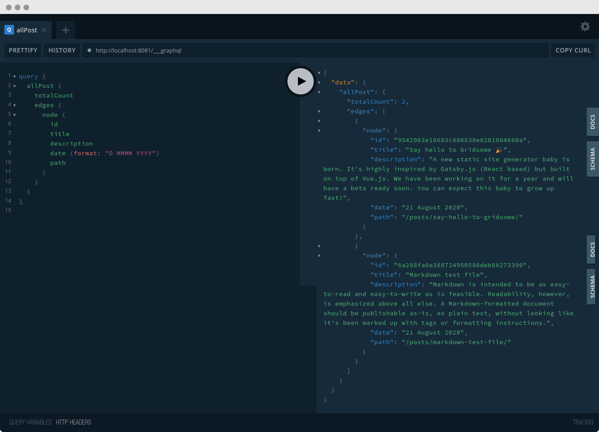

<br />

الآن سيتم عرض لنا المقالات التي تم جلبها بهذا الشكل 🎉

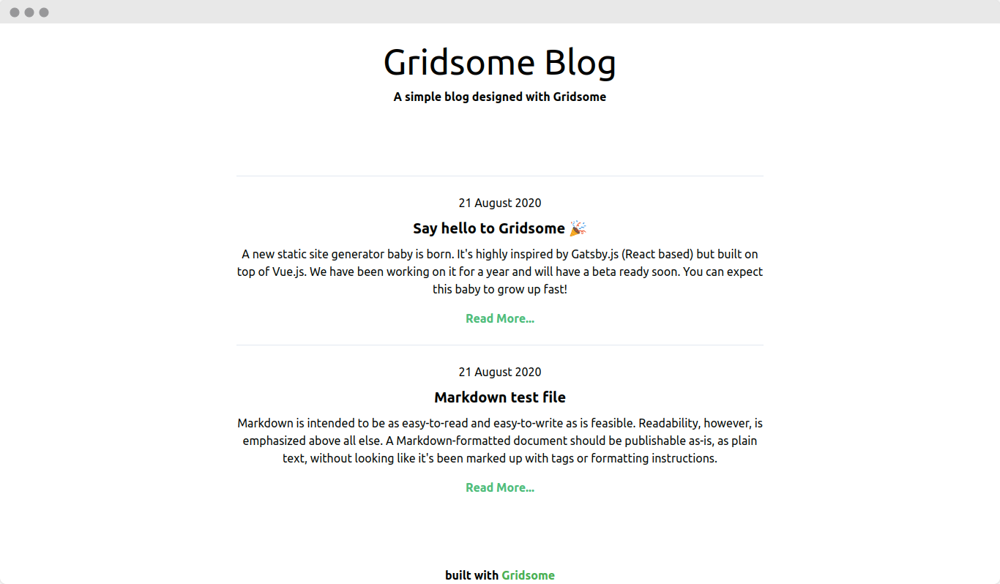

<br />

# عرض مكون Pages {id="toc11" class="font-bold text-2xl mb-6"}

بقيت لدينا آخر خطوة و هي عرض كل مقالة على حدى. لهذا سنقوم بإنشاء ملف جديد في المسار `src/templates/Post.vue` و نضيف له التالي:

<br />

```html{codeTitle: "In src/templates/Post.vue"}
<template>
  <Layout>
    <br />
    <g-link to="/" class="font-bold text-red-500">
      &larr; Go Back
    </g-link>
    <div>
      <h1 class="text-5xl my-4">
        {{$page.post.title}}
      </h1>
      <p class="font-bold italic underline mb-2">
        {{ $page.post.date}}
      </p>
    </div>
    <div class="leading-7 mt-10">
      <p v-html="$page.post.content" />
    </div>
  </Layout>
</template>

<page-query>
  query Post ($path: String!) { 
    post: post (path: $path) { 
      id 
      title 
      content 
      date
      (format: "D MMMM YYYY") 
    } 
  }
</page-query>
```

<br />

الآن بالضغط على زر `...Read More` سيتم عرض لنا المقالة مُفردة بهذا الشكل:

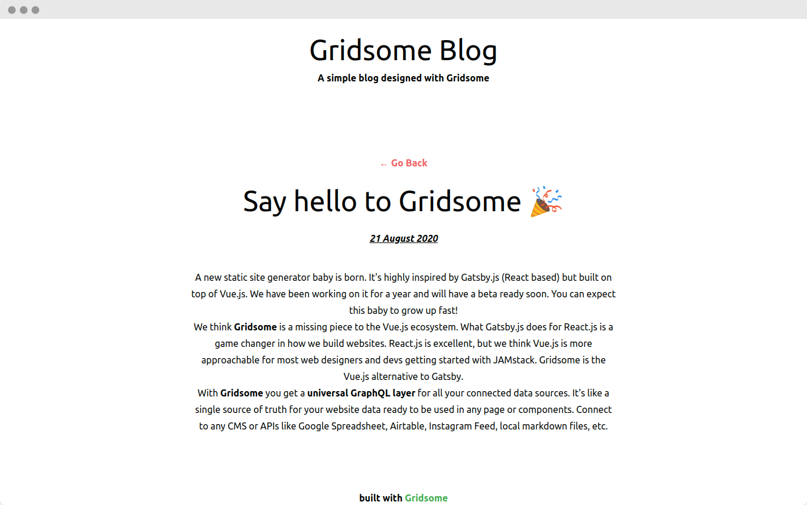

# رفع المشروع على إستظافة {id="toc12" class="font-bold text-2xl mb-6"}

بعد إنشاء موقع أيا ما كان, أكيد نريد أن نقوم برفعه على الأنترنت ليراه العالم. لهذا سنقوم بإستخدام إستظافة [**Netlify**](https://www.netlify.com/){id="ext-link"}. أفترض أنك قُمت برفع المشروع على موقع [**GitHub**](https://github.com/){id="ext-link"}. العملية سهلة جدا كل ما عليك القيام به هو إتباع الخطوات الآتية:

<br />

نضغط على زر `New site from Git`

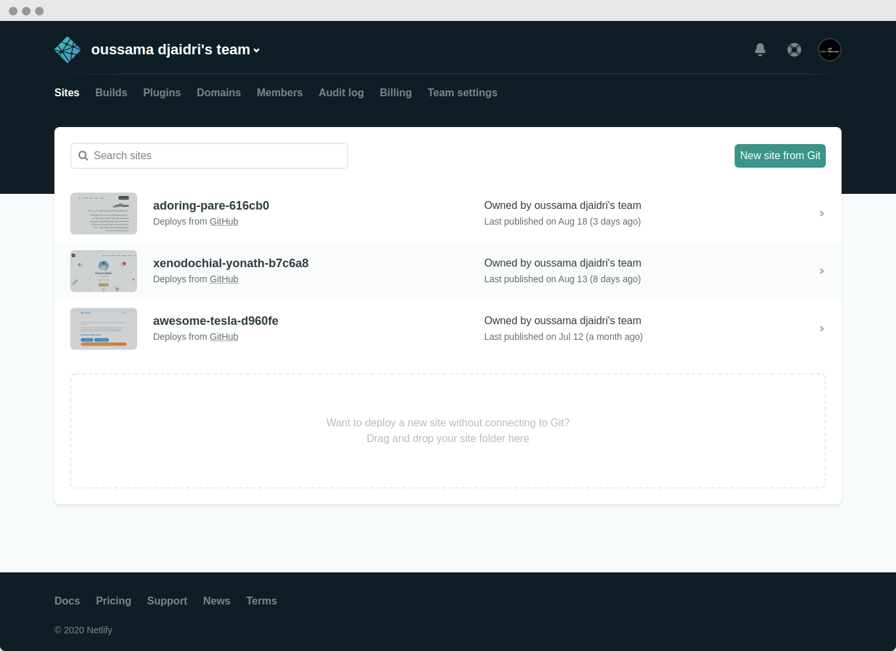

نقوم بإختيار مكان رفع المشروع. في حالتنا سنختار **GitHub**

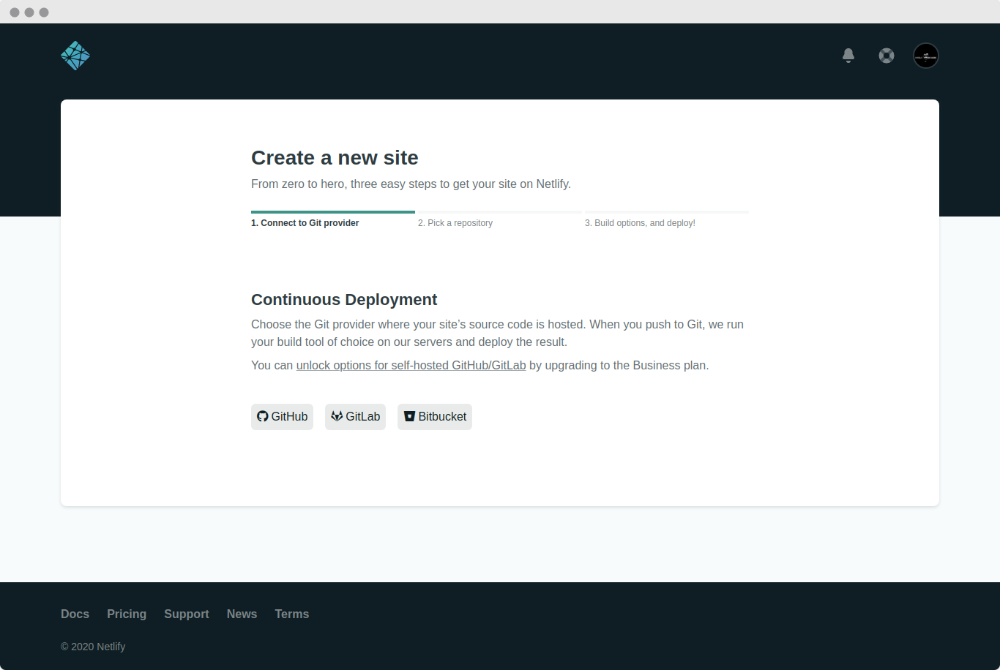

نختار إسم المستودع الذي رفعنا عليه المشروع, إذا لم يظهر لك أي اسم مستودع قم بالضغط على كلمة **Configure the Netlify app on Github** و قُم بإعطاء الصلاحيات للوصول إلى كل المستودعات أو يُمكنك إختيار مستودع محدد

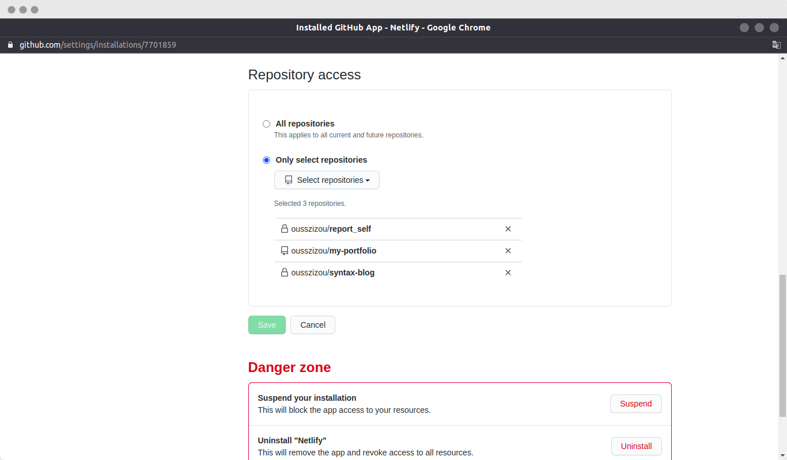

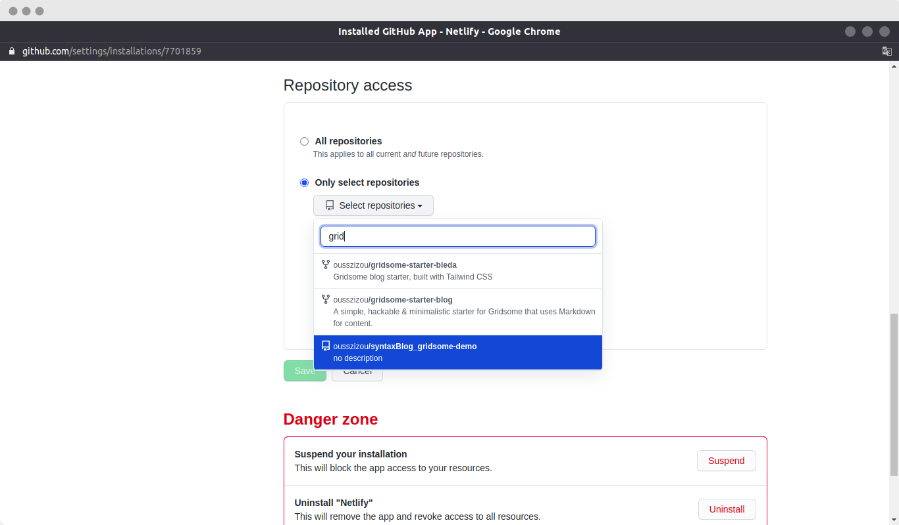

نختار المستودع الذي يحمل المشروع بعد ظهوره في القائمة

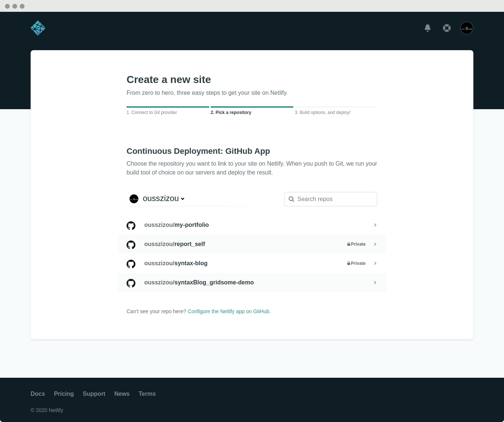

نحتاج في هاته الخطوة إلى تعريف شيئان مهمان و هما أمر إنشاء نسخة الإنتاج لأنها هي التي يتم إستظافتها و المجلد الذي سيحتوي على نسخة الإنتاج و عادة يكون مجلد `dist` و تضغط على زر **Deploy site**.

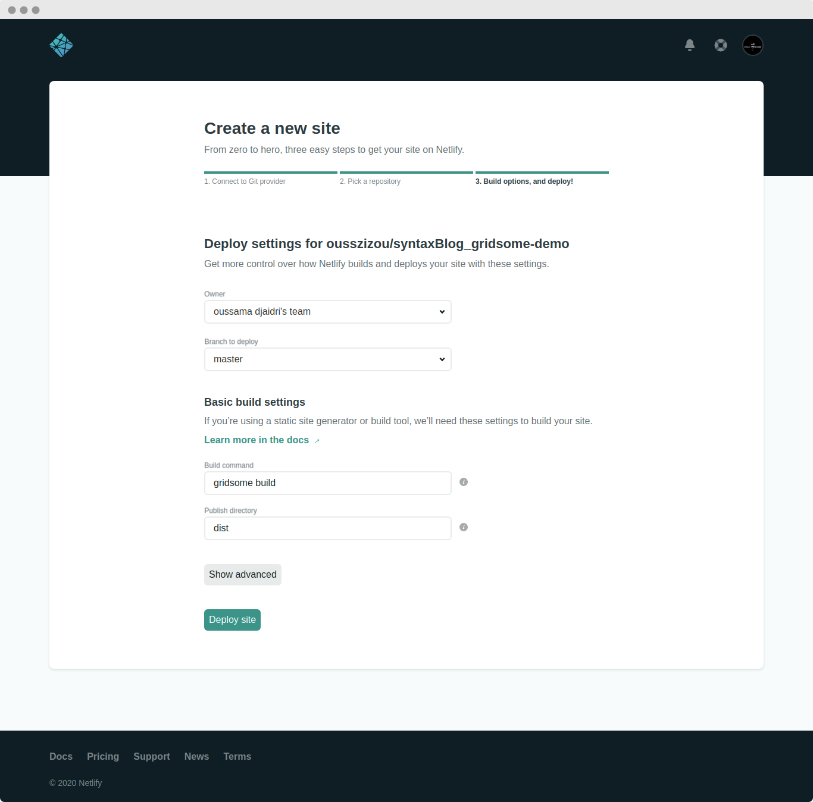

العملية تستغرق بضع دقائق فقط. ننتظر أن تتغير كلمة *Building* إلى *Published*. 

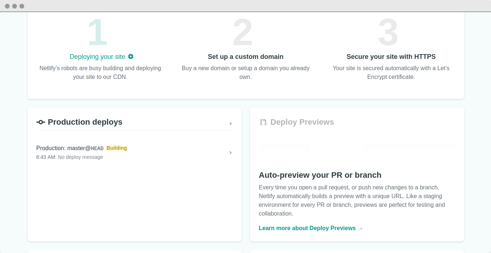

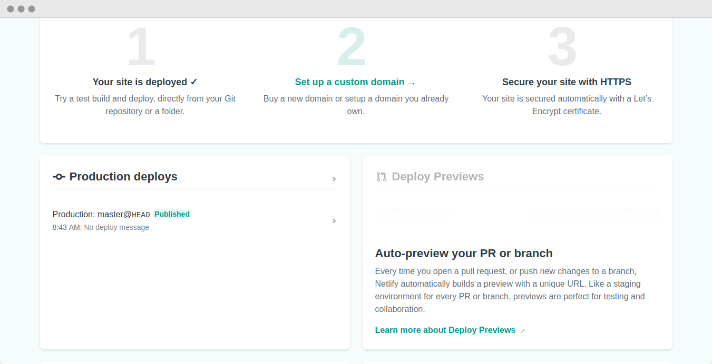

و مبروك عليك 🎉 أول موقع لك بإستخدام **Gridsome**. نفتح الرآبط التالي لمعاينته أونلاين `https://keen-tesla-1c5005.netlify.app`

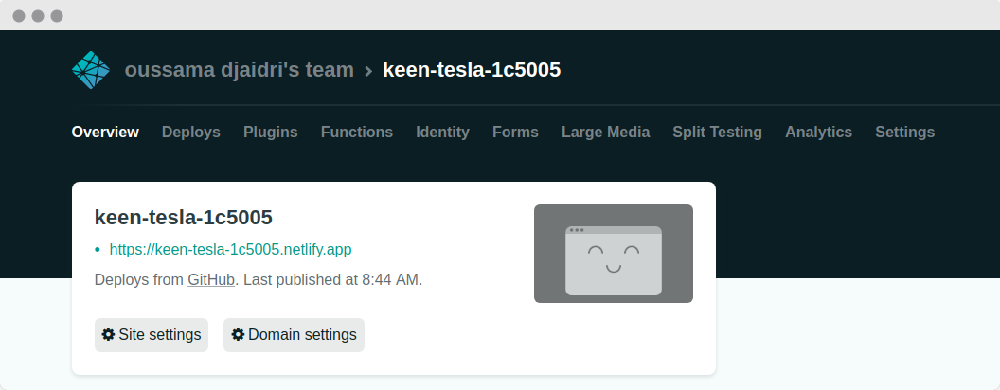

<br />

# الختام {id="toc13" class="font-bold text-2xl mb-6"}

في هاته المقالة تطرقنا لعمل مدونة بسيطة بإستخدام **Gridsome** و الإعتماد على ملفات *markdown* في تخزين المقالات و كيف تعمل الإضافات على تسهيل تحويل الملفات و جلبها عن طريق *GraphQL*.  مرورا بطريقة إنشاء المكونات التي تعرضها لنا وصولا إلى رفع المدونة أونلاين.

<br />

طبعا هنالك الكثير لم نتطرق له بعد و هذا يأتي بعمل مشاريع متنوعة تغطي معظم ميزات **Gridsome**. هنالك 3 مشاريع سنُوفرها في قسم الدورات و التي ستغطي أشياء متقدمة في **Gridsome**. أتمنى أنكم إستفدتم من هاته المقالة, نلتقي في مقالات قادمة و دمتم في رعاية الله. 
